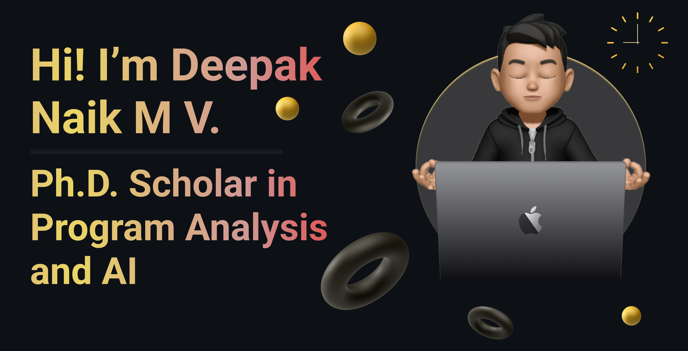

<h3 align="center">Ph.D. Scholar in Program Analysis and AI | Amrita Vishwa Vidyapeetham | B.Tech ComputerScience | M.Tech Artificial Intelligence</h3>

  

    
  

- 🔭 I’m currently working on **Extending the capabilities of a language specific application using Code Migration**

- 🌱 I’m currently learning **Few-shot Learning, CodeT5, Optimizing LLM's for task specific adaptation**

- 💬 Ask me about **Programming, Machine Learning, Artificial Intelligence, Image processing, Block Chain, Full Stack Development**

- 📫 How to reach me **deepaknaikmv01@gmail.com**

- ⚡ Fun fact **I am into FPS gaming mainly CS:GO, Valorant etc... Also into cooking, gardening, learning about spirituality and the list goes on :)**

  

  
  

    

  

  

<h3 align="left">Connect with me:</h3>

<h3 align="left">Languages and Tools:</h3>

                             

<h3 align="left">Github Trophies:</h3>

  

&nbsp;

    <h3 style="color: #333;">Papers Published</h3>

  <h4>Hybrid Feature Set based Mitotic Detection in Breast Histopathology Images</h4>
    <ul>
        <li><strong>Abstract:</strong> Breast cancer is a very serious threat to women and requires faster diagnosis methods to decrease the mortality rates. Automatic detection of mitosis is very difficult when compared to other pattern detection since mitotic cells are irregularly shaped objects, therefore there is no simple way of extracting features of a mitotic cell. This paper proposes a novel method with which a dataset comprising of shape and texture features are created from the image patches extracted from whole-slide histopathology images (MITOS-ATYPIA-14). The extracted image patches are converted to blue ratio images and hysteresis thresholding is applied for better edge detection. The ROI is extracted and a set of 10 shape features and 34 texture features are then extracted from each segmented image to form a hybrid feature dataset. Correlation-based feature selection is used to obtain the dominant features which can classify the data points as mitotic and non-mitotic. The dataset is then used to train seven models and classification is performed on unannotated image patches and the best model is selected based on the accuracy.</li>
        <li><strong>Area of Research:</strong> Breast Cancer Detection</li>
        <li><strong>Conference Published:</strong> 2022 International Conference on Inventive Computation Technologies (ICICT)</li>
        <li><strong>DOI:</strong> <a href="https://doi.org/10.1109/ICICT54344.2022.9850552" style="color: #007bff;">https://doi.org/10.1109/ICICT54344.2022.9850552</a></li>
    </ul>

<h4>Cross-Language Code Mapping with Transformer Encoder-decoder Model</h4>
  <ul>
        <li><strong>Abstract:</strong>In the dynamic field of software development, knowledge of multiple programming languages is increasingly valued. To address the demand for cross-language systems, our research investigates code translation and proposes a new approach using transformer models to map cross-language codes. We draw inspiration from the success of transformer-based neural networks in natural language processing and apply these models to the complex world of programming languages. A central hypothesis is that transformers can effectively translate code between languages, acting as a bridge between programming paradigms. We develop a custom transformer encoder-decoder model for program-to-program translation that is initialized with a dataset containing C++ programs and corresponding codes in Haxe, Kotlin, Python, and Java. The cooperation between the encoder and the decoder allows a smooth translation of the code, which shows considerable adaptability. Through fine-tuning with data from other programming languages like Kotlin and Python, our model extends its translation capabilities. Enabling Haxe as an intermediate language further facilitates translation to target languages like Java. This adaptability, based on a transformer-based architecture, effectively meets the challenges of an ever-evolving programming environment. It should be noted that our approach differs from large language models in terms of programming complexity and capturing  OOP design patterns. In addition to translation, our research paves a way for code visualization using tools such as Java interactive visualization environment. "Cross-Language Code Mapping with Transformer Models" marks a significant advance towards automatic code translation in object-oriented programming, enriching developer tool kits and promoting collaboration across language boundaries in software engineering. </li>
        <li><strong>Area of Research:</strong>Code Migration</li>
        <li><strong>Conference Published:</strong> International symposium of intelligent informatics</li>
    </ul>

